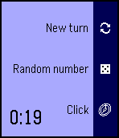
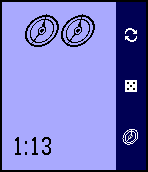
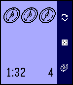

PebRunner
=========

PebRunner is an
[Android: Netrunner](https://www.fantasyflightgames.com/en/products/android-netrunner-the-card-game/)
assistant for your wrist! It features a click tracker, random number
generator and round timer. It supports the original Pebble models as
well as new Pebble Time models with colour screens.

*Note*: this is not an official app, I am in no way associated with
[Fantasy Flight Games](https://www.fantasyflightgames.com/en/index/). This
app is purely for fun, hopefully you find it useful!

## Features

* pressing the Down button will advance the Pebble app's click tracker
* pressing Select will generate a random number between 1 and 5 (useful for randomising hand access)
* pressing Up will start a new turn
* a round timer is visible in the bottom right of the watch's screen

### Pebble Time / Pebble Time Steel

  

  

### Pebble / Pebble Steel

  

## Installing

PebRunner is available in the Pebble appstore!

You can also install the app (including old versions) via the `pbw`
files available in the Releases section of this repository. Alternatively
you can install the app from source code using the SDK.

## Changelog

### v0.5

* round timer display
* help text displays between turns
* redesign of app allows for up to 9 clicks per turn

### v0.4

* official Pebble Time support
* blue/red display for corp/runner turns
* improved action bar on pebbletime
* tweaked layout of clicks so it displays more consistently across devices

### v0.3

* improved design!
* action bar to describe button behaviours

### v0.2

* correct app name
* improve memory management slightly

### v0.1

First version of the app!

### Upcoming features

* improved design
* psi-game number wizard
* more flexible hand randomisation (not just 1-5)
* faction icons (and colours for Pebble Time)

## Issues / contact

If you find any problems or generally have any questions feel free to
raise an issue on this repository. I'd love to hear if you've found it
helpful. Pull Requests are welcome :-)

### Known issues

It only supports 9 clicks at the moment (that's all that fit on
screen). If you have a super-janky-combo deck that needs more than 9
clicks in a turn then good for you captain jank, but I can't help! If
you continue past 9 it'll start from 1 again so you'll still be able
to use PebRunner to help.

Random numbers are currently chosen from 1-5 and there's currently no
way to change this.

## Thanks

Thanks to
[Fantasy Flight Games](https://www.fantasyflightgames.com/en/index/)
for creating the superb game of Android: Netrunner.

Thanks also to [MWDelaney](https://github.com/MWDelaney) for creating
the
[Netrunner ttf font](https://github.com/MWDelaney/Netrunner-Icon-Font)
used in this Pebble app.
