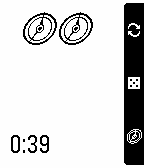
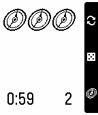

PebRunner
=========

PebRunner is an
[Android: Netrunner](https://www.fantasyflightgames.com/en/products/android-netrunner-the-card-game/)
assistant for your wrist! It features a click tracker and random
number generator.

*Note*: this is not an official app, I am in no way associated with
[Fantasy Flight Games](https://www.fantasyflightgames.com/en/index/). This
app is purely for fun, hopefully you find it useful!

## Features

* Pressing the Down button will advance the Pebble app's click tracker
* Pressing Select will generate a random number between 1 and 5 (useful for randomising hand access)
* Pressing Up will start a new turn

  

## Installing

PebRunner is available in the Pebble appstore!

You can also install old versions of the app using the SDK or via the
`pbw` files available in the Releases section of this repository.

## Changelog

### v0.3

* improved design!
* action bar to describe button behaviours

### v0.2

* correct app name
* improve memory management slightly

### v0.1

First version of the app!

### Upcoming features

* faction icons (and colours for Pebble Time)
* improved design
* psi-game number wizard
* more flexible hand randomisation (not just 1-5)

## Issues / contact

If you find any problems or generally have any questions feel free to
raise an issue on this repository. I'd love to hear if you've found it
helpful. Pull Requests are welcome :-)

### Known issues

It only supports 6 clicks at the moment (that's all that fit on
screen). If you have a super-janky-combo deck that needs more than 6
clicks in a turn then good for you but you'll struggle here. If you
continue past 6 it'll start from 1 again so you should still be able
to use PebRunner to help.

Random numbers are currently chosen from 1-5 and there's currently no
way to change this.

## Thanks

Thanks to
[Fantasy Flight Games](https://www.fantasyflightgames.com/en/index/)
for creating the superb game of Android: Netrunner.

Thanks also to [MWDelaney](https://github.com/MWDelaney) for creating
the
[Netrunner ttf font](https://github.com/MWDelaney/Netrunner-Icon-Font)
used in this Pebble app.
